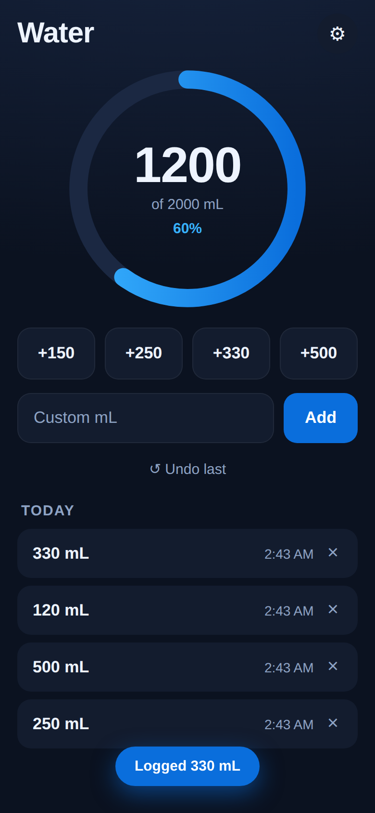

# 💧 Water Tracker

A tiny, offline-first web app for logging how much water you drink each day, in
**mL**. Add it to your iPhone Home Screen like a native app, and wire up a
**Lock Screen shortcut** so you can log a glass of water without unlocking or
opening anything.



## What it does

- Big tap targets: **+150 / +250 / +330 / +500 mL**, plus a custom amount.
- A progress ring toward your **daily goal** (default 2000 mL, editable).
- Today's log with per-entry delete and one-tap **undo**.
- **Automatically resets at midnight** (keyed to your local calendar day).
- **Works fully offline** — data is stored on your device (localStorage), no
  account, no server, nothing leaves your phone.
- **`?add=` URL** support so the iOS Shortcuts app can log water for you.

---

## About "iPhone widgets" — read this first

A real iOS **Lock Screen widget** (the little circular gauges under the clock)
can only be built by a native app in Xcode/Swift. A web app can't render one.

But you can get the one-tap, from-the-lock-screen experience two ways:

1. **Home Screen app (PWA).** Add this site to your Home Screen and it opens
   full-screen with its own icon — indistinguishable from a native app for
   logging.
2. **Lock Screen / Home Screen *Shortcut*.** The **Shortcuts** app *can* place a
   button on your Lock Screen, and this app understands a `?add=250` URL. So a
   Shortcut tap = "log 250 mL" instantly. Setup is below.

---

## 1) Put it online (one-time)

The app is just static files, so any static host works. Easiest is **GitHub
Pages** (already wired up in this repo):

1. Push this repo to GitHub (branch `main` or the feature branch).
2. On GitHub: **Settings → Pages → Build and deployment → Source = GitHub
   Actions**.
3. The included workflow (`.github/workflows/deploy.yml`) publishes it. Your URL
   will look like:
   `https://<your-username>.github.io/<repo-name>/`

> Prefer something else? Netlify, Vercel, Cloudflare Pages, or even opening
> `index.html` locally all work. It must be served over **https** for
> Add-to-Home-Screen + offline to work (GitHub Pages is https by default).

## 2) Add to your iPhone Home Screen

1. Open the URL in **Safari** (must be Safari, not Chrome).
2. Tap the **Share** button → **Add to Home Screen** → **Add**.
3. Launch it from the new **Water** icon. It runs full-screen and offline.

## 3) (Best part) One-tap logging from the Lock Screen

Use the built-in **Shortcuts** app to make buttons that log water via the
`?add=` URL. Create one shortcut per amount you like (e.g. 250 mL, 500 mL):

1. Open **Shortcuts** → **+** (new shortcut).
2. Add action **"Open URLs"** (search "URL").
3. Set the URL to your site plus the amount, e.g.
   `https://<your-username>.github.io/<repo-name>/?add=250`
4. Name it something like **"Water +250"** and pick a 💧 icon/color.
5. Repeat for other amounts.

**Put it on the Lock Screen:**

- Long-press the Lock Screen → **Customize** → tap the widget area under the
  clock → add the **Shortcuts** widget → choose your "Water +250" shortcut.
- Now tapping it opens the app, silently logs the amount, and shows a
  confirmation. (iOS may ask for Face ID once to open Safari — that's an OS
  rule for opening web pages, not the app.)

**Even faster — no browser flash:** create a Shortcut with **"Get Contents of
URL"** pointing at `…/?add=250` instead of "Open URLs". Combined with a Home
Screen or Lock Screen button, it can fire in the background. (Note: the totals
are stored per-browser, so opening the app is what always shows the freshest
number — "Open URLs" is the most reliable choice.)

You can also add the shortcut to your Home Screen or run it with Siri:
*"Hey Siri, Water +250."*

---

## Settings

Tap the ⚙︎ icon to change your **daily goal** or clear today's log.

## Privacy

Everything is stored locally in your browser via `localStorage`. There is no
backend and no analytics. Clearing Safari's data for the site (or deleting the
Home Screen app) erases your history.

## Development

Static site — no build step. To poke at it locally:

```bash
python3 -m http.server 8000   # then open http://localhost:8000
```

Regenerate the app icons after tweaking the design:

```bash
python3 tools/make_icons.py
```

Run the headless smoke test (requires `npm install playwright`):

```bash
node tools/smoke.js
```

## Files

| File | Purpose |
| --- | --- |
| `index.html` | App markup |
| `style.css` | Styling (dark, iOS-flavored) |
| `app.js` | Logging logic, storage, `?add=` handling |
| `manifest.json` | PWA metadata (installable) |
| `sw.js` | Service worker (offline cache) |
| `icons/` | App icons (generated) |
| `tools/make_icons.py` | Icon generator |
| `tools/smoke.js` | Headless test |
